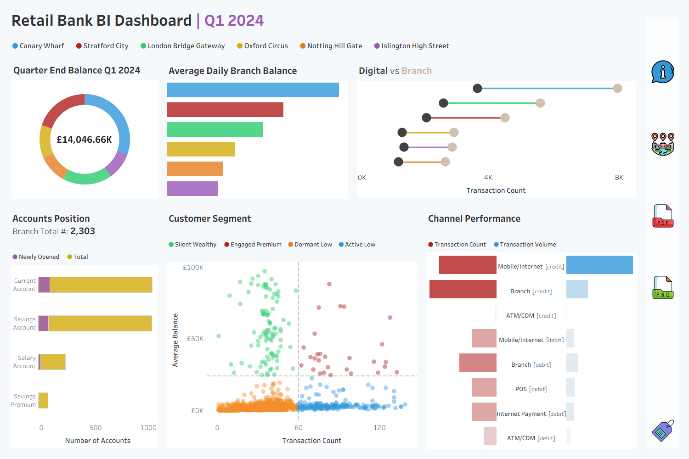

# 🏦 Retail Bank BI Dashboard

---

## 💡 Project Overview
This project showcases the development of an interactive **Tableau dashboard** for delivering executive-level KPIs and deep operational insights for **Q1 2024** across six UK-based retail bank branches. The dashboard provides critical views into account activity, branch performance, and channel usage to support decisions related to digital adoption, operational efficiency, and business development.

> ▶️ **Intended Audience**: Executives and Regional Business Development Managers

---

## 🚀 Project Requirements

### 📂 Data Source
- Powered by the **Gold Layer** from the [Retail Banking Data Warehouse](https://github.com/NavinSuresh/retail_banking_dwh)
- Synthetic data generated using Python's `Faker` library
- Tables used:
  - `gold_fact_transaction.csv`
  - `gold_dim_account.csv`
  - `gold_dim_customer.csv`
- Data dictionary and model diagram available in the `/docs` folder

### 💼 Business Goals
- Deliver a high-level overview of:
  - Overall KPIs
  - Branch and operational performance
  - Customer behavior and channel usage
  - Transaction volumes and account balances
- Enable interactivity through:
  - Branch selector filter to analyze individual or multiple branches.
  - Quick action filters to engage with chart elements.

### 📄 Documentation
- Comprehensive **data dictionary**
- **Star schema** data model diagram
- **PowerPoint presentation** of key insights for stakeholders

---

## 📸 Dashboard Preview



---

## 📂 Repository Structure
```
bank-dashboard/
│
├── datasets/                           # Gold layer CSVs (customer, account, transaction)
│
│── dashboard/                          # Tableau workbook (.twbx) + screenshots
│
├── docs/                               # Project documentation and architecture details
│   ├── data_dictionary.md              # Catalog of datasets with field descriptions & metadata
│   ├── data_model.png                  # Star schema data model
│   ├── insights.pptx                   # Stakeholder presentation with findings & recommendations
│
├── README.md                           # Project overview and requirements
├── LICENSE                             # License information for the repository
├── .gitignore                          # Files and directories to be ignored by Git
```

---

## 👨‍💼 Technology Stack
- **Database**: PostgreSQL  
- **Business Intelligence**: Tableau
- **Version Control**: Git / GitHub

---

## ✨ Key Skills Demonstrated
- **Business Acumen**: Translating real-world business needs into data-driven dashboards
- **Data Modeling**: Building a clean star schema optimized for analytics
- **Dashboard Design**: Creating stakeholder-centric visual stories in Tableau
- **Data Storytelling**: Distilling insights into concise, actionable narratives
- **Analytical Thinking**: Designing customer segmentation and performance KPIs
- **Documentation**: Producing high-quality technical and business documentation

---

## 🛡️ License
This project is licensed under the [MIT License](LICENSE). You are free to use, modify, and share this work with proper attribution.

---

## 🙋‍♂️ About Me
Hi, I'm **Navin Suresh** - a data analyst with a background in financial services. I'm passionate about transforming data into business solutions that support growth, efficiency, and strategy.

**Data Analyst | BI Developer | Reporting**  
📧 your.email@example.com  
🔗— [LinkedIn](https://linkedin.com/in/your-profile) ❓ [Portfolio](https://your-site.com)

