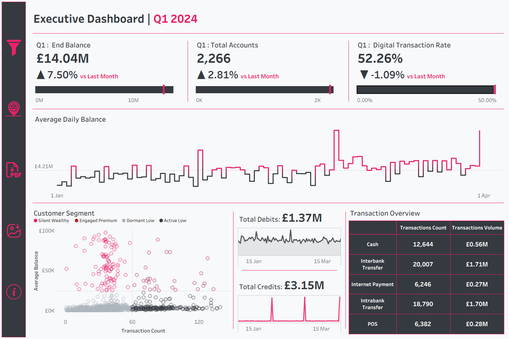
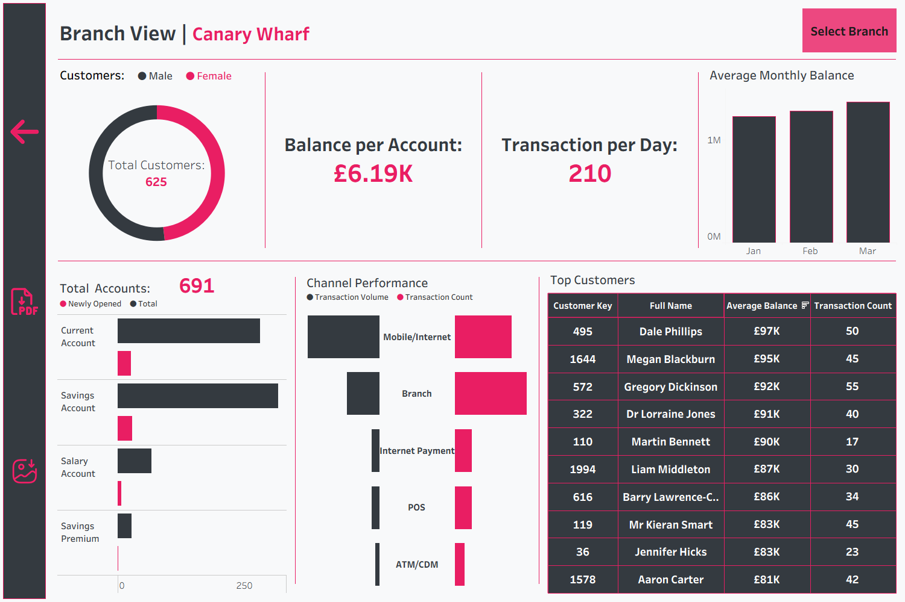

# 🏦 Retail Bank BI Dashboard

---

## 💡 Project Overview
This project showcases the development of an interactive [**Tableau dashboard**](https://public.tableau.com/app/profile/navin.suresh5969/viz/RetailBankBIDashboard-ExecutiveBranchInsights/EXECDashboard) for delivering executive-level KPIs and detailed branch-level insights for **Q1 2024** across six UK-based retail bank branches. The dashboard provides critical views into account activity, branch performance, customer segmentation, and channel usage to support decisions on digital adoption, operational efficiency, and business development.

> ▶️ **Intended Audience**: Executives, Regional Business Development Managers, and Branch Managers

---

## 🚀 Project Requirements

### 📂 Data Source
- Powered by the **Gold Layer** from the [Retail Banking Data Warehouse](https://github.com/NavinSuresh/retail_banking_dwh)
- Synthetic data generated using Python's `Faker` library
- Tables used:
  - `fact_transaction`  
  - `dim_account`  
  - `dim_customer`  
  - `dim_date`  
  - `dim_transaction_code`  
- Data dictionary and model diagram available in the `/docs` folder

### 💼 Business Goals
- Deliver both **executive-level KPIs** and **branch-level operational insights**:  
  - Month-end balances, account counts, and digital transaction rates  
  - Branch-wise account performance and customer demographics  
  - Channel adoption and transaction distribution across mobile, internet, ATM, and branch  
  - Customer segmentation by balance and activity levels  
  - Track balances over time to monitor trends, detect anomalies, and support operational decision-making  
- Enable interactivity through:
  - Filters for month, zone, and account type  
  - Branch selector for deeper analysis of individual branches  
  - Export options for PDF and PNG  
  - Navigation buttons for seamless movement between dashboards  

### 📄 Documentation
- Comprehensive **data dictionary**
- **Star schema** data model diagram
- **PowerPoint presentation** of key insights for stakeholders

---

## 📸 Dashboard Preview





---

## 📂 Repository Structure
```
bank-dashboard/
│
├── datasets/                           # CSVs (customer, account, transaction, date, transaction code)
│
│── dashboard/                          # Tableau workbook (.twbx) + screenshots
│
├── docs/                               # Project documentation and model details
│   ├── data_dictionary.md              # Catalog of datasets with field descriptions & metadata
│   ├── data_model.png                  # Star schema data model
│   ├── insights.pptx                   # Stakeholder presentation with findings & recommendations
│
├── README.md                           # Project overview and requirements
├── LICENSE                             # License information for the repository
├── .gitignore                          # Files and directories to be ignored by Git
```

---

## 👨‍💼 Technology Stack
- **Database**: PostgreSQL  
- **Business Intelligence**: Tableau
- **Version Control**: Git / GitHub

---

## ✨ Key Skills Demonstrated
- **Business Acumen**: Translating real-world business needs into data-driven dashboards
- **Data Modeling**: Building a clean star schema optimized for analytics
- **Dashboard Design**: Creating stakeholder-centric visual stories in Tableau
- **Data Storytelling**: Distilling insights into concise, actionable narratives
- **Analytical Thinking**: Designing customer segmentation and performance KPIs
- **Documentation**: Producing high-quality technical and business documentation

---

## 🛡️ License
This project is licensed under the [MIT License](LICENSE). You are free to use, modify, and share this work with proper attribution.

---

## 🙋‍♂️ About Me
Hi, I'm **Navin Suresh** - a data analyst with a background in financial services. I'm passionate about transforming data into business solutions that support growth, efficiency, and strategy.

**Data Analyst | BI Developer | Reporting**  
📧 navinsuresh1@gmail.com  


